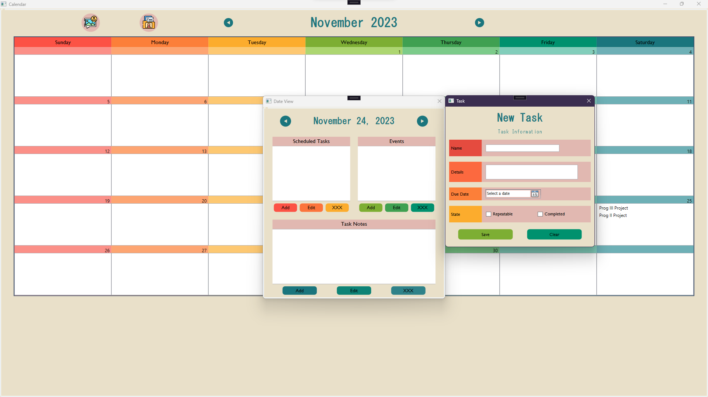

The final project in Programming III, the project that marked the halfway point of the entire program, was left open-ended for students to take in almost any direction they wished. There were guidelines, to be clear: 

- We had to make use of WPF to design a genuine user interface: Most of our previous works were console-only, barring a few exceptions. This was a step up for our cohort.
- We'd spent the last 7 weeks or so learning the four pillars of OOP languages, and this project in it's flexibility was designed to allow us to show our mastery of those concepts.

Moreover, this project was done in pairs, which added some extra complexity around balancing work between two people. Thankfully, my teammate and I worked extremely well together, and fell quite cleanly into front-end and back-end work, my being the latter. Our app took the concept of a simple task manager we'd coded for a previous assignment, and up the complexity of the work while giving it a clean UI to work with. The final product is shown below, with full UI credits going to [dianakarpeev](https://github.com/dianakarpeev):

I learned some incredible skills, the one I'm most proud of being the JSOHN serialization to save and load calendars, something we hadn't learned at all and something I was able to develop in a few hours. I also learned som valuable lessons regarding how important communication between front and back end is needed. I went into the project worried that one of us would step on the other's toes while working to try and force connections between the front and back, but since we were working asynchronously, we prioritized communication and because of that, we never ran into an issue on that front.

You can find a copy of our work [here](https://github.com/ClockWorkElementals/rubber-duckies-calendar-app)
