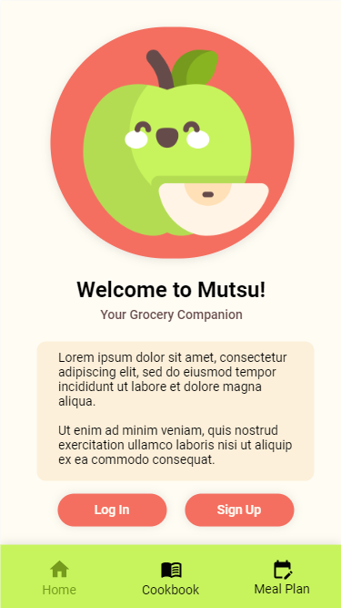

While looking through past projects is helpful to show my growth, it makes little sense developing these skills while they're not currently in use. 

At the moment, I'm currently working with a group of my peers to jump in the deep-end of app development by stepping away from the PC and moving onto our phones, exploring the chaotic world of Android app development in the process. Our app, still in development, is addressing our personal gripes with food related apps in that we haven't found a satisfying app to handle recipe to ingredient list calculations for purposes of developing a grocery list. Our app is hoping to address that.

However, our app is still very much currently in development. If you want more information on this current project, check our repository out, linked at the bottom of the page. In the meantime, enjoy this concept art, courtesy of [dianakarpeev](https://github.com/dianakarpeev):

If our app's premise caught your eye, [check out Mutsu here!](https://github.com/dianakarpeev/mutsu)
