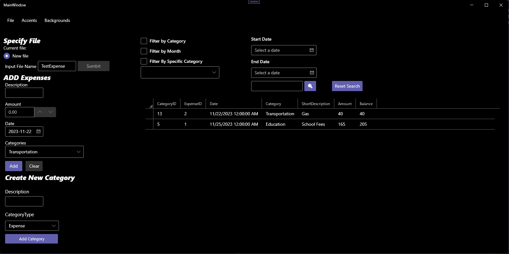

Over the course of 5 months, my Application Development course simulated an Agile work environment with the task of building a budget app that can be used for years to come. We started with some code written years ago with intentionally poor documentation to give us a taste of working on code written by others. 

The end product?

While the process wasn't without it's issues, our group did incredibly well all things considered. We incorporated nearly all the optional features that provided ease of use and the Windows 11 style forms, along with all the customization that comes with their colors, was something I worked at length to incorporate into the project. An incredible amount of effort went into this project, and I'm thankful for my teammates because the biggest skill learned through the course was working alongside them. Personally, this project was in my comfort zone with C#, so I expanded my knowledge with the customization and upholding good Github and JIRA practices.

You can find our code [here](https://github.com/NitpreetA/Milestone6_Team_YourName)

//Note: At the moment, the repository is private. I'm in the process of making it public and I'll edit this note out when that's the case.
